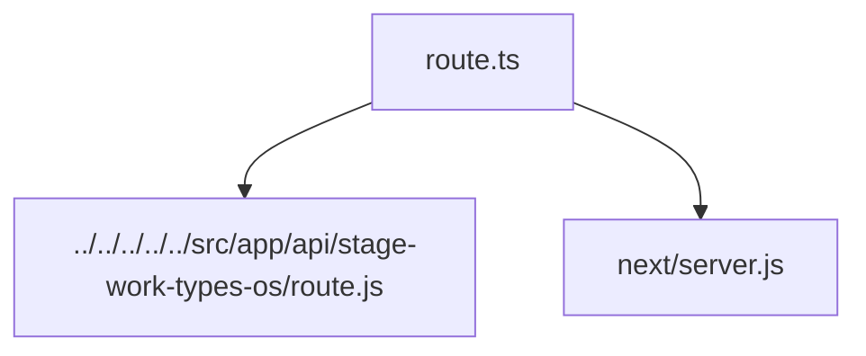

# Документация для `route.ts`

*Путь к файлу: `src/..\.next\types\app\api\stage-work-types-os\route.ts`*

## Зависимости файла

### `PageProps` (Interface)

*Источник: `src/..\.next\types\app\api\stage-work-types-os\route.ts`*

---
### `LayoutProps` (Interface)

*Источник: `src/..\.next\types\app\api\stage-work-types-os\route.ts`*

---
