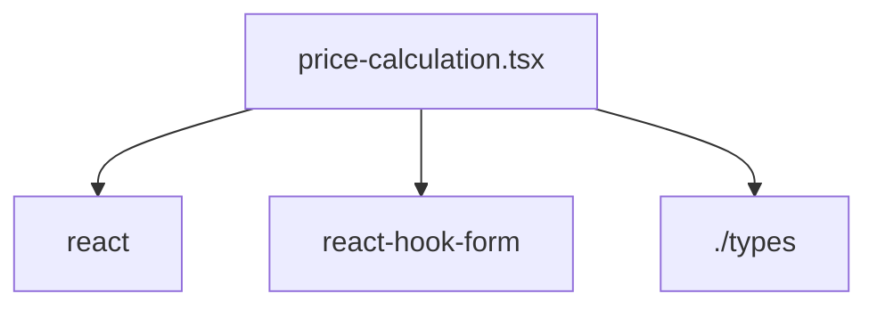

# Документация для `price-calculation.tsx`

*Путь к файлу: `src/app\(app)\orders\[orderId]\components\price-calculation.tsx`*

## Зависимости файла

### `PriceCalculation` (ReactComponent)

**Пропсы (Props):**

| Имя | Тип | Обязательный | Описание |
|---|---|---|---|
| `calculatedPrices` | `CalculatedPrices` | Да |  |
| `form` | `UseFormReturn<StageOptionFormValues>` | Да |  |
| `units` | `VolumeUnit[]` | Да |  |
| `orderCurrency` | `string` | Да |  |

**Возвращает:** `React.JSX.Element`

*Источник: `src/app\(app)\orders\[orderId]\components\price-calculation.tsx`*

---
### `default` (ReactComponent)

**Пропсы (Props):**

| Имя | Тип | Обязательный | Описание |
|---|---|---|---|
| `calculatedPrices` | `CalculatedPrices` | Да |  |
| `form` | `UseFormReturn<StageOptionFormValues>` | Да |  |
| `units` | `VolumeUnit[]` | Да |  |
| `orderCurrency` | `string` | Да |  |

**Возвращает:** `React.JSX.Element`

*Источник: `src/app\(app)\orders\[orderId]\components\price-calculation.tsx`*

---
