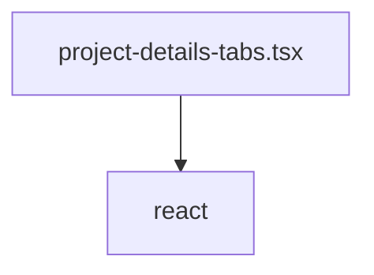

# Документация для `project-details-tabs.tsx`

*Путь к файлу: `src/app\(app)\projects\[projectId]\project-details-tabs.tsx`*

## Зависимости файла

### `default` (ReactComponent)

**Пропсы (Props):**

| Имя | Тип | Обязательный | Описание |
|---|---|---|---|
| `project` | `Project` | Да |  |

**Возвращает:** `React.JSX.Element`

*Источник: `src/app\(app)\projects\[projectId]\project-details-tabs.tsx`*

---
### `Project` (TypeAlias)

*Источник: `src/app\(app)\projects\[projectId]\project-details-tabs.tsx`*

---
