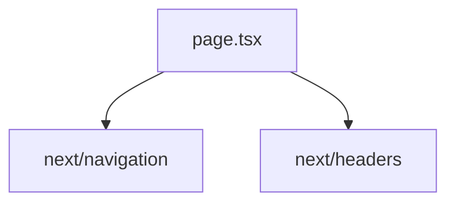

# Документация для `page.tsx`

*Путь к файлу: `src/app\page.tsx`*

## Зависимости файла

```mermaid
flowchart TD
    page_tsx[page.tsx]
    navigation[next/navigation]
    page_tsx --> navigation
    headers[next/headers]
    page_tsx --> headers
```

### `default` (Function)

**Возвращает:** `Promise<never>`

*Источник: `src/app\page.tsx`*

---
