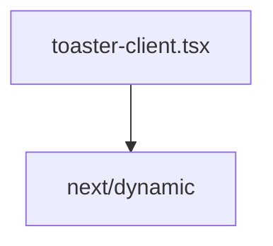

# Документация для `toaster-client.tsx`

*Путь к файлу: `src/components\layout\toaster-client.tsx`*

## Зависимости файла

### `default` (Variable (CallExpression))

*Источник: `src/components\layout\toaster-client.tsx`*

---
