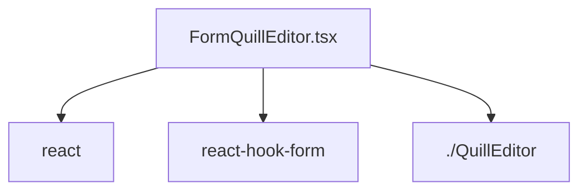

# Документация для `FormQuillEditor.tsx`

*Путь к файлу: `src/components\editor\quill\FormQuillEditor.tsx`*

## Зависимости файла

### `FormQuillEditor` (ReactComponent)

**Пропсы (Props):**

| Имя | Тип | Обязательный | Описание |
|---|---|---|---|
| `name` | `string` | Да |  |
| `label` | `string` | Нет |  |
| `placeholder` | `string` | Нет |  |
| `className` | `string` | Нет |  |
| `defaultToolbarType` | `QuillToolbarType` | Нет |  |

**Возвращает:** `React.JSX.Element`

*Источник: `src/components\editor\quill\FormQuillEditor.tsx`*

---
