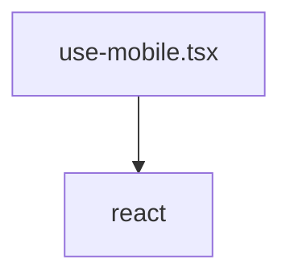

# Документация для `use-mobile.tsx`

*Путь к файлу: `src/hooks\use-mobile.tsx`*

## Зависимости файла

### `useIsMobile` (Function)

**Возвращает:** `boolean`

*Источник: `src/hooks\use-mobile.tsx`*

---
