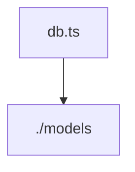

# Документация для `db.ts`

*Путь к файлу: `src/lib\db.ts`*

## Зависимости файла

### `sequelize` (Variable (PropertyAccessExpression))

*Источник: `src/lib\db.ts`*

---
### `Sequelize` (Variable (PropertyAccessExpression))

*Источник: `src/lib\db.ts`*

---
### `User` (Variable (PropertyAccessExpression))

*Источник: `src/lib\db.ts`*

---
### `Customer` (Variable (PropertyAccessExpression))

*Источник: `src/lib\db.ts`*

---
### `Project` (Variable (PropertyAccessExpression))

*Источник: `src/lib\db.ts`*

---
### `Order` (Variable (PropertyAccessExpression))

*Источник: `src/lib\db.ts`*

---
### `ProjectStatusOS` (Variable (PropertyAccessExpression))

*Источник: `src/lib\db.ts`*

---
### `CurrencyOS` (Variable (PropertyAccessExpression))

*Источник: `src/lib\db.ts`*

---
### `Stage` (Variable (PropertyAccessExpression))

*Источник: `src/lib\db.ts`*

---
### `StageOption` (Variable (PropertyAccessExpression))

*Источник: `src/lib\db.ts`*

---
### `UnitOs` (Variable (PropertyAccessExpression))

*Источник: `src/lib\db.ts`*

---
### `connectDB` (Variable (PropertyAccessExpression))

*Источник: `src/lib\db.ts`*

---
### `default` (Variable (ObjectLiteralExpression))

*Источник: `src/lib\db.ts`*

---
