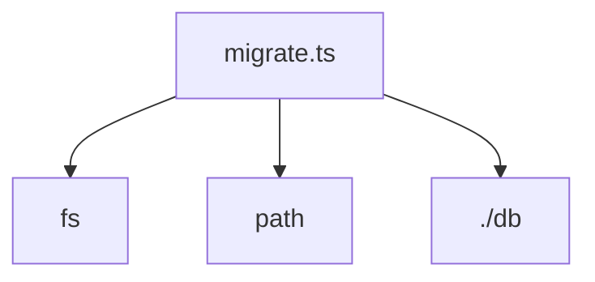

# Документация для `migrate.ts`

*Путь к файлу: `src/lib\migrate.ts`*

## Зависимости файла

```mermaid
flowchart TD
    migrate_ts[migrate.ts]
    fs[fs]
    migrate_ts --> fs
    path[path]
    migrate_ts --> path
    db[./db]
    migrate_ts --> db
```

### `runMigrations` (Function)

**Возвращает:** `Promise<void>`

*Источник: `src/lib\migrate.ts`*

---
