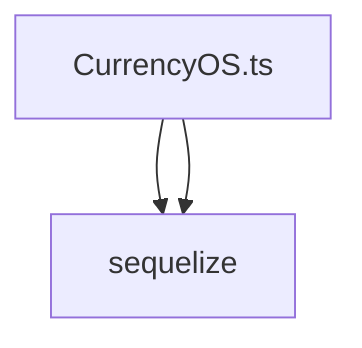

# Документация для `CurrencyOS.ts`

*Путь к файлу: `src/lib\models\CurrencyOS.ts`*

## Зависимости файла

### `default` (Function)

**Параметры:**

| Имя | Тип | Опциональный | Описание |
|---|---|---|---|
| `sequelize` | `SequelizeInstance` | Нет |  |

**Возвращает:** `typeof CurrencyOS`

*Источник: `src/lib\models\CurrencyOS.ts`*

---
### `CurrencyOS` (Class)

*Источник: `src/lib\models\CurrencyOS.ts`*

---
### `CurrencyOSAttributes` (Interface)

*Источник: `src/lib\models\CurrencyOS.ts`*

---
### `CurrencyOSCreationAttributes` (Interface)

*Источник: `src/lib\models\CurrencyOS.ts`*

---
