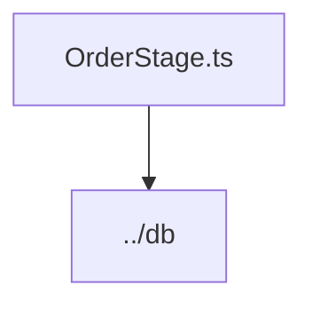

# Документация для `OrderStage.ts`

*Путь к файлу: `src/lib\models\OrderStage.ts`*

## Зависимости файла

### `OrderStage` (Interface)

*Источник: `src/lib\models\OrderStage.ts`*

---
### `OrderStageModel` (Variable (ObjectLiteralExpression))

*Источник: `src/lib\models\OrderStage.ts`*

---
