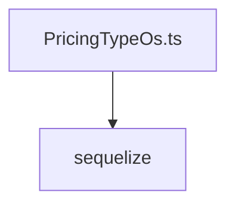

# Документация для `PricingTypeOs.ts`

*Путь к файлу: `src/lib\models\PricingTypeOs.ts`*

## Зависимости файла

### `PricingTypeOsAttributes` (Interface)

*Источник: `src/lib\models\PricingTypeOs.ts`*

---
### `PricingTypeOsCreationAttributes` (TypeAlias)

*Источник: `src/lib\models\PricingTypeOs.ts`*

---
### `PricingTypeOs` (Class)

*Источник: `src/lib\models\PricingTypeOs.ts`*

---
### `default` (Function)

**Параметры:**

| Имя | Тип | Опциональный | Описание |
|---|---|---|---|
| `sequelize` | `Sequelize` | Нет |  |

**Возвращает:** `typeof import("E:/Business/Projects/studio/src/lib/models/PricingTypeOs").PricingTypeOs`

*Источник: `src/lib\models\PricingTypeOs.ts`*

---
