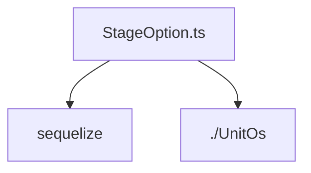

# Документация для `StageOption.ts`

*Путь к файлу: `src/lib\models\StageOption.ts`*

## Зависимости файла

### `StageOptionAttributes` (Interface)

*Источник: `src/lib\models\StageOption.ts`*

---
### `StageOptionCreationAttributes` (TypeAlias)

*Источник: `src/lib\models\StageOption.ts`*

---
### `StageOption` (Class)

*Источник: `src/lib\models\StageOption.ts`*

---
### `default` (Function)

**Параметры:**

| Имя | Тип | Опциональный | Описание |
|---|---|---|---|
| `sequelize` | `Sequelize` | Нет |  |

**Возвращает:** `typeof import("E:/Business/Projects/studio/src/lib/models/StageOption").StageOption`

*Источник: `src/lib\models\StageOption.ts`*

---
