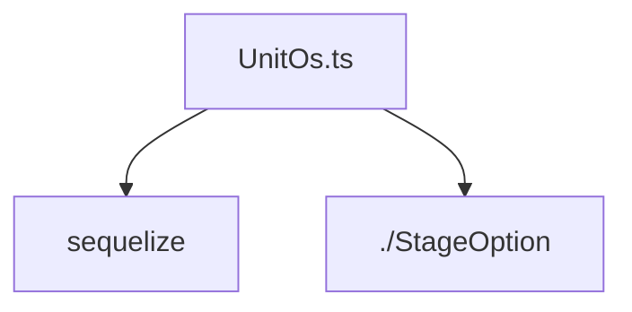

# Документация для `UnitOs.ts`

*Путь к файлу: `src/lib\models\UnitOs.ts`*

## Зависимости файла

### `UnitOsAttributes` (Interface)

*Источник: `src/lib\models\UnitOs.ts`*

---
### `UnitOsCreationAttributes` (Interface)

*Источник: `src/lib\models\UnitOs.ts`*

---
### `UnitOs` (Class)

*Источник: `src/lib\models\UnitOs.ts`*

---
### `default` (ArrowFunction)

*Источник: `src/lib\models\UnitOs.ts`*

---
