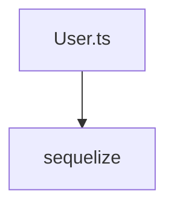

# Документация для `User.ts`

*Путь к файлу: `src/lib\models\User.ts`*

## Зависимости файла

### `default` (Function)

**Параметры:**

| Имя | Тип | Опциональный | Описание |
|---|---|---|---|
| `sequelize` | `Sequelize` | Нет |  |

**Возвращает:** `ModelStatic<UserInstance>`

*Источник: `src/lib\models\User.ts`*

---
### `UserAttributes` (Interface)

*Источник: `src/lib\models\User.ts`*

---
### `UserInstance` (Interface)

*Источник: `src/lib\models\User.ts`*

---
