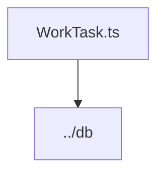

# Документация для `WorkTask.ts`

*Путь к файлу: `src/lib\models\WorkTask.ts`*

## Зависимости файла

### `WorkTask` (Interface)

*Источник: `src/lib\models\WorkTask.ts`*

---
### `WorkTaskModel` (Variable (ObjectLiteralExpression))

*Источник: `src/lib\models\WorkTask.ts`*

---
