# Документация для `index.ts`

*Путь к файлу: `src/lib\models\index.ts`*

## Зависимости файла

```mermaid
flowchart TD
    index_ts[index.ts]
    sequelize[sequelize]
    index_ts --> sequelize
    dotenv[dotenv]
    index_ts --> dotenv
    pg[pg]
    index_ts --> pg
    User[./User]
    index_ts --> User
    Customer[./Customer]
    index_ts --> Customer
    Project[./Project]
    index_ts --> Project
    Order[./Order]
    index_ts --> Order
    ProjectStatusOS[./ProjectStatusOS]
    index_ts --> ProjectStatusOS
    OrderStatusOS[./OrderStatusOS]
    index_ts --> OrderStatusOS
    CurrencyOS[./CurrencyOS]
    index_ts --> CurrencyOS
    Stage[./Stage]
    index_ts --> Stage
    StageOption[./StageOption]
    index_ts --> StageOption
    StageWorkTypeOS[./StageWorkTypeOS]
    index_ts --> StageWorkTypeOS
    PricingTypeOs[./PricingTypeOs]
    index_ts --> PricingTypeOs
    UnitOs[./UnitOs]
    index_ts --> UnitOs
```

### `connectDB` (Function)

**Возвращает:** `Promise<void>`

*Источник: `src/lib\models\index.ts`*

---
### `default` (Variable (ObjectLiteralExpression))

*Источник: `src/lib\models\index.ts`*

---
