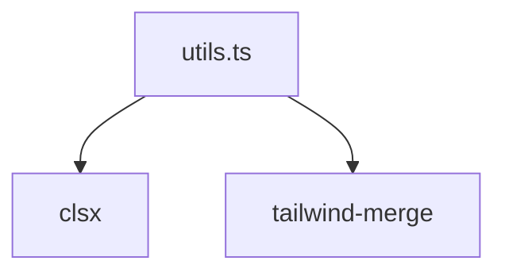

# Документация для `utils.ts`

*Путь к файлу: `src/lib\utils.ts`*

## Зависимости файла

### `cn` (Function)

**Параметры:**

| Имя | Тип | Опциональный | Описание |
|---|---|---|---|
| `inputs` | `ClassValue[]` | Да |  |

**Возвращает:** `string`

*Источник: `src/lib\utils.ts`*

---
