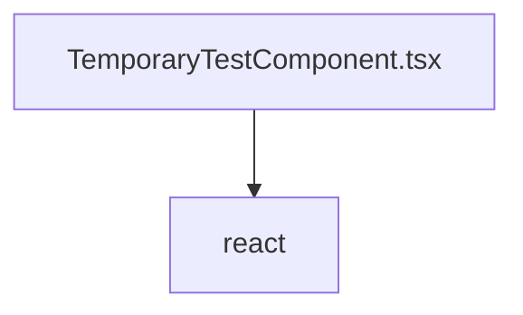

# Документация для `TemporaryTestComponent.tsx`

*Путь к файлу: `src/components\temp\TemporaryTestComponent.tsx`*

## Зависимости файла

### `default` (ReactComponent)

**Возвращает:** `React.JSX.Element`

*Источник: `src/components\temp\TemporaryTestComponent.tsx`*

---
