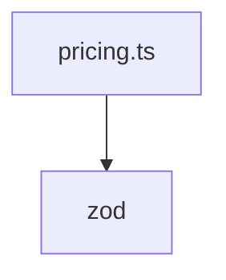

# Документация для `pricing.ts`

*Путь к файлу: `src/types\pricing.ts`*

## Зависимости файла

### `PricingType` (Interface)

*Источник: `src/types\pricing.ts`*

---
### `pricingTypeFormSchema` (Variable (CallExpression))

*Источник: `src/types\pricing.ts`*

---
### `PricingTypeFormValues` (TypeAlias)

*Источник: `src/types\pricing.ts`*

---
### `PricingTypeFormData` (Interface)

*Источник: `src/types\pricing.ts`*

---
