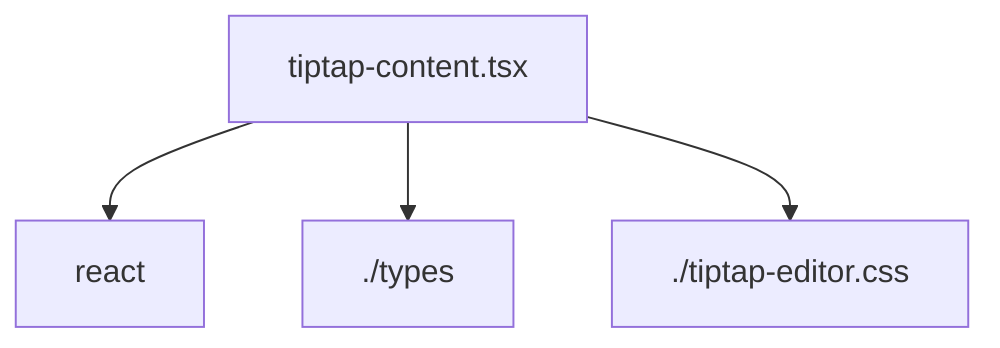

# Документация для `tiptap-content.tsx`

*Путь к файлу: `src/components\ui\tiptap\tiptap-content.tsx`*

## Зависимости файла

### `TiptapContent` (ReactComponent)

**Пропсы (Props):**

| Имя | Тип | Обязательный | Описание |
|---|---|---|---|
| `content` | `string \| null` | Да |  |
| `className` | `string` | Нет |  |

**Возвращает:** `React.JSX.Element \| null`

*Источник: `src/components\ui\tiptap\tiptap-content.tsx`*

---
