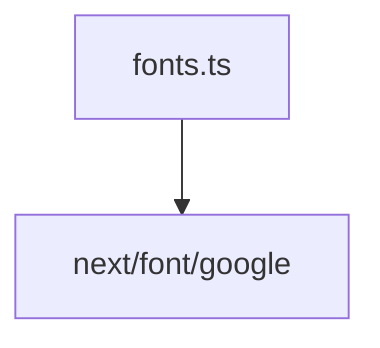

# Документация для `fonts.ts`

*Путь к файлу: `src/utils\fonts.ts`*

## Зависимости файла

### `useGoogleFont` (Function)

**Параметры:**

| Имя | Тип | Опциональный | Описание |
|---|---|---|---|
| `fontName` | `string` | Нет |  |

**Возвращает:** `string`

*Источник: `src/utils\fonts.ts`*

---
### `inter` (Variable (CallExpression))

*Источник: `src/utils\fonts.ts`*

---
