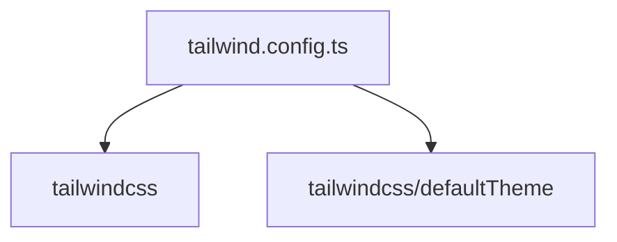

# Документация для `tailwind.config.ts`

*Путь к файлу: `src/..\tailwind.config.ts`*

## Зависимости файла

```mermaid
flowchart TD
    tailwind_config_ts[tailwind.config.ts]
    tailwindcss[tailwindcss]
    tailwind_config_ts --> tailwindcss
    defaultTheme[tailwindcss/defaultTheme]
    tailwind_config_ts --> defaultTheme
```

### `default` (SatisfiesExpression)

*Источник: `src/..\tailwind.config.ts`*

---
